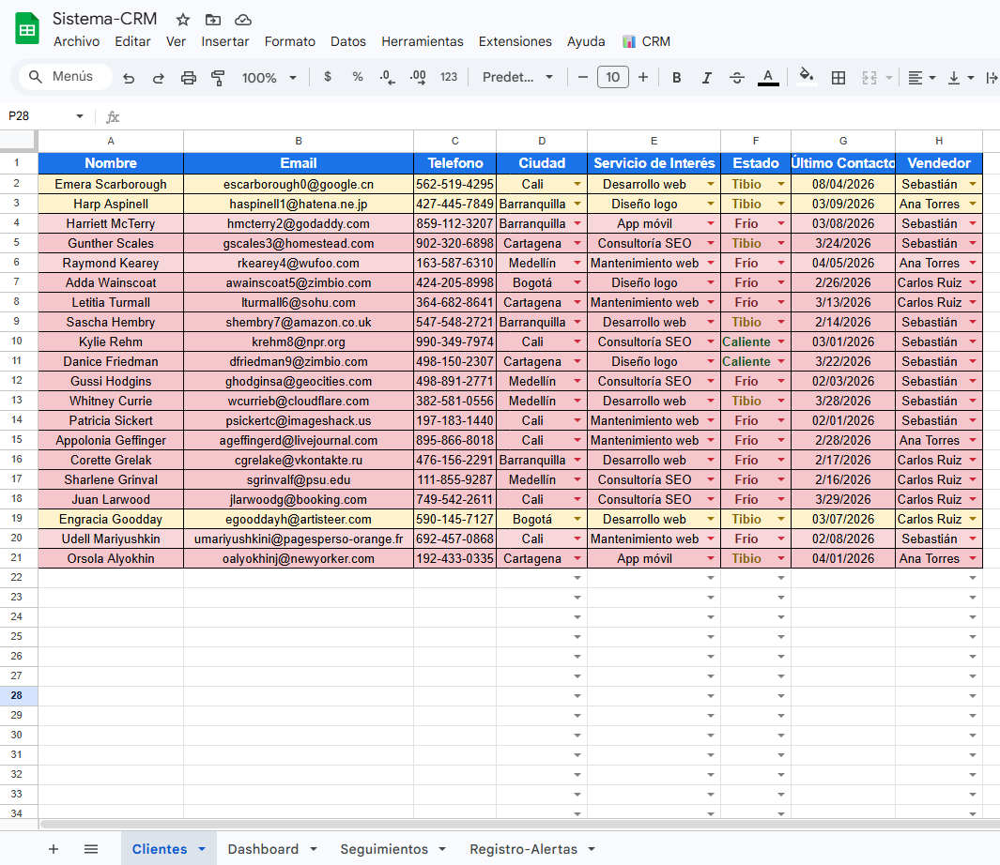
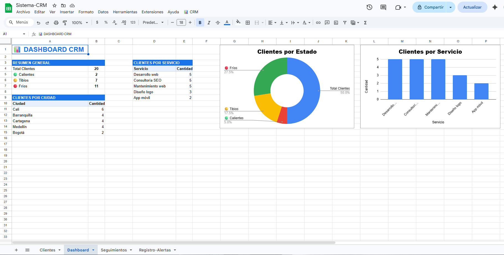
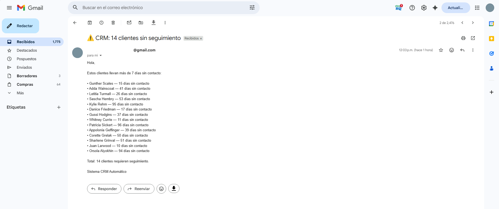

# 📊 CRM Automático — Google Apps Script

Sistema de gestión de clientes (CRM) construido 100% en Google Sheets
con Apps Script como backend. Ideal para equipos de ventas pequeños
que no quieren pagar por HubSpot o Salesforce.

---

## 🚀 ¿Qué hace?

- Colorea clientes automáticamente según estado (🟢 Caliente / 🟡 Tibio / 🔴 Frío)
- Envía alertas por Gmail cuando un cliente lleva +7 días sin contacto
- Dashboard automático con KPIs, tablas y gráficas
- Registro de seguimientos con actualización automática de último contacto
- Validaciones en todas las columnas para evitar errores
- Trigger semanal automático cada lunes a las 8am

---

## 🛠️ Tecnologías

- Google Apps Script (JavaScript)
- Google Sheets (base de datos)
- Gmail API (alertas automáticas)

---

## 📸 Demo

---

## ⚙️ Instalación

1. Crea un Google Sheets con 4 hojas:
   `Clientes`, `Dashboard`, `Seguimientos`, `Registro-Alertas`
2. En Apps Script copia `Codigo.gs` y `_config.example.gs`
3. Renombra `_config.example.gs` → `_config.gs`
4. Cambia el email en `_config.gs` por el tuyo
5. Recarga el Sheets → aparece el menú **📊 CRM**
6. Ejecuta **⚙️ Configurar validaciones** primero

---

## 📋 Uso

| Acción | Cómo |
|---|---|
| Colorear clientes | Menú 📊 CRM → Aplicar colores |
| Ver dashboard | Menú 📊 CRM → Actualizar Dashboard |
| Registrar seguimiento | Menú 📊 CRM → Registrar seguimiento |
| Enviar alertas | Menú 📊 CRM → Enviar alertas |

---

## 👨‍💻 Autor

**Sebastián Felipe Otalora Guevara**
Estudiante de Inteligencia Artificial y Cómputo
[GitHub](https://github.com/SebastiianGuevara)

---

## 📄 Licencia

MIT License
